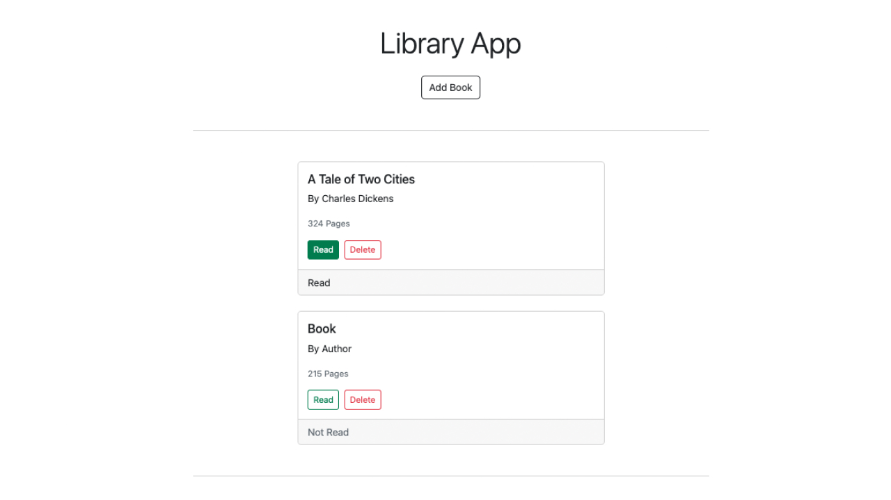

<h1 align=center>
  <a href="">Library App<a>
</h1>

  <i>
    Book tracking web application built on HTML, CSS, Bootstrap, and Vanilla Typescript.
  </i>

## Dependencies

- @popperjs/core 2.11.6
- bootstrap 5.2.1
- typescript 4.6.4
- sass 1.55.0
- vite 3.1.0
- uuid 9.0.0
